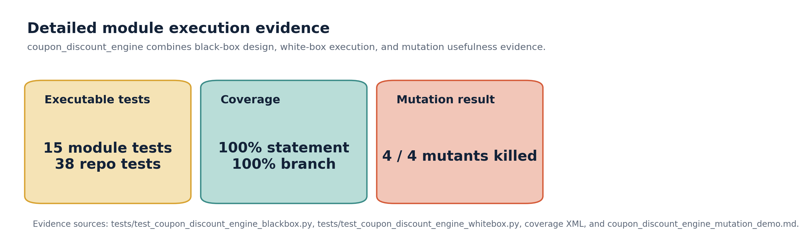

# Detailed Test Design and Execution

## 1. Target Application and Selected Major Module

### 1.1 Target Application Context

The independent application under test in this final project is **MiniShop Checkout**, a compact e-commerce checkout prototype implemented in:

- `target_app/minishop_checkout/`

Its formal definition is recorded in:

- `final_docs/12_target_application_definition_cn.md`

`MiniShop Checkout` includes the following concrete application modules:

- cart and checkout preview orchestration
- promotion and coupon logic
- shipping fee calculation
- tax and order-total calculation
- payment-card validation
- pickup-station and recipient validation

This document focuses on one selected major module of that application, as required by the assignment.

### 1.2 Selected Major Module

This document treats `coupon_discount_engine` as the selected major feature/module of `MiniShop Checkout`. It belongs to the application's **Promotion service** and is not the AutoTestDesign tool itself.

Its role inside the final project is:

- to preserve a concrete and independently executable application module inside `MiniShop Checkout`
- to show that the test designs produced or refined with `ARG-Test` can be translated into black-box and white-box tests
- to provide executable evidence for a high-risk financial-rule component of the target application

This module is a strong detailed-execution target because it combines:

- valid and invalid input partitions
- multiple numeric boundaries
- interacting business rules
- explicit expected results
- a compact reference implementation suitable for white-box execution

The module is suitable for detailed execution because its expected behavior is explicit, reviewable, and rich enough to require more than one testing technique. A single nominal-path test would not be sufficient: the module has rejection rules, threshold rules, membership restrictions, and implementation branches that must be checked together.

## 2. Requirement Basis and Scope

### 2.1 Formalized Requirement Summary

The detailed execution document uses the following normalized rules derived from the final requirement set and the selected reference implementation:

- R1: only one coupon may be applied to an order
- R2: unknown coupon codes must be rejected
- R3: expired coupons must be rejected
- R4: `SAVE10` requires `subtotal >= 50`
- R5: `SAVE20` requires `subtotal >= 100`
- R6: `SAVE20` also requires premium membership
- R7: `SAVE20` cannot be combined with sale items
- R8: `FREESHIP` requires `subtotal >= 30`
- R9: no-coupon input should leave subtotal and shipping unchanged

These rules define the coverage items used in the rest of the document. The black-box design focuses on externally visible behavior from these rules, while the white-box design checks whether the executable reference implementation exercises all important branches that implement them.

### 2.2 Implementation Under Test

| Item | Path |
| --- | --- |
| Target application package | `target_app/minishop_checkout/` |
| Promotion-service entry point | `target_app/minishop_checkout/promotion.py` |
| Checkout integration path | `target_app/minishop_checkout/checkout.py` |
| Reference implementation | `reference_impl/coupon_discount_engine.py` |
| Black-box tests | `tests/test_coupon_discount_engine_blackbox.py` |
| White-box tests | `tests/test_coupon_discount_engine_whitebox.py` |
| Seeded mutants | `reference_impl/coupon_discount_engine_mutants.py` |

The detailed module is executed through the preserved `reference_impl` path so that the strongest existing `pytest`, coverage, and mutation evidence remains valid. At the same time, the application package now imports the same coupon engine through the promotion-service layer, which means the detailed module is part of the chosen target application rather than an isolated helper script.

## 3. Test Environment and Tooling

| Tool | Purpose |
| --- | --- |
| `pytest` | execute black-box and white-box test cases |
| `coverage.py` | collect statement and branch coverage |
| mutant functions | demonstrate defect detection usefulness |

`pytest` was selected because the reference implementation is a compact Python module and the expected outcomes can be expressed directly with assertions. `coverage.py` was added to connect the test design with executable evidence. Branch coverage is especially useful here because coupon logic is implemented through conditionals, not only straight-line statements.

Commands used:

```powershell
python -m pytest tests\test_coupon_discount_engine_blackbox.py tests\test_coupon_discount_engine_whitebox.py -q
python -m pytest tests -q
python -m coverage run --branch -m pytest tests -q
python -m coverage report -m reference_impl\coupon_discount_engine.py
python -m coverage xml -o final_docs\execution_evidence\coupon_discount_engine_coverage.xml
python -m coverage xml -o final_docs\execution_evidence\coupon_discount_engine_branch_coverage.xml
```

## 4. Black-Box Test Design

The black-box design was derived from the requirement rules without relying on internal implementation details. Three techniques are used together because they cover different risks. Equivalence Partitioning separates valid and invalid classes. Boundary Value Analysis targets monetary thresholds where off-by-one or inclusive/exclusive mistakes are likely. Decision Table Testing captures business-rule combinations, especially for `SAVE20`, where multiple conditions interact.

### 4.1 Equivalence Partitioning

| Partition ID | Partition type | Representative condition | Designed test(s) | Expected result |
| --- | --- | --- | --- | --- |
| EP1 | valid | no coupon provided | `BB01` | accept and keep subtotal/shipping unchanged |
| EP2 | invalid | more than one coupon provided | `BB02` | reject with one-coupon-only reason |
| EP3 | invalid | unknown coupon code | `BB03` | reject with unknown-coupon reason |
| EP4 | invalid | expired coupon | `BB04` | reject with expired-coupon reason |
| EP5 | invalid | premium-only coupon used by non-premium customer | `BB07` | reject with membership reason |
| EP6 | invalid | restricted coupon combined with sale items | `BB08` | reject with sale-item restriction reason |
| EP7 | valid | `SAVE20` with all preconditions satisfied | `BB09` | accept and apply 20% discount |

### 4.2 Boundary Value Analysis

| Boundary ID | Threshold | Below | On boundary | Above / valid representative | Designed test(s) |
| --- | --- | --- | --- | --- | --- |
| B1 | `SAVE10` subtotal `50` | `49` | `50` | `60` | `BB05`, `BB06`, `WB05` |
| B2 | `SAVE20` subtotal `100` | `99` | `100` | `120` | `WB03`, `BB09` |
| B3 | `FREESHIP` subtotal `30` | `29` | `30` | `80` with no coupon | `WB04`, `BB10`, `BB01` |

### 4.3 Decision Table

| Rule | Coupon | Threshold met | Premium member | Sale items present | Expired | Expected outcome |
| --- | --- | --- | --- | --- | --- | --- |
| D1 | none | N/A | N/A | N/A | N/A | accept, no change |
| D2 | `SAVE10` | no | N/A | N/A | no | reject |
| D3 | `SAVE10` | yes | N/A | N/A | no | accept, 10% discount |
| D4 | `SAVE20` | yes | no | no | no | reject |
| D5 | `SAVE20` | yes | yes | yes | no | reject |
| D6 | `SAVE20` | yes | yes | no | no | accept, 20% discount |
| D7 | `FREESHIP` | no | N/A | N/A | no | reject |
| D8 | `FREESHIP` | yes | N/A | N/A | no | accept, shipping becomes zero |

### 4.4 Executable Black-Box Cases

| Test ID | `pytest` function | Main technique | Covered rule / purpose |
| --- | --- | --- | --- |
| BB01 | `test_no_coupon_keeps_order_values` | EP | no-coupon valid partition |
| BB02 | `test_multiple_coupons_are_rejected` | EP | one-coupon-only rejection |
| BB03 | `test_unknown_coupon_is_rejected` | EP | unknown coupon rejection |
| BB04 | `test_expired_coupon_is_rejected` | EP | expired coupon rejection |
| BB05 | `test_save10_boundary_below_threshold_is_rejected` | BVA | `SAVE10` just below threshold |
| BB06 | `test_save10_boundary_on_threshold_is_accepted` | BVA | `SAVE10` exact threshold acceptance |
| BB07 | `test_save20_requires_premium_membership` | EP / decision table | premium requirement |
| BB08 | `test_save20_with_sale_items_is_rejected` | EP / decision table | sale-item restriction |
| BB09 | `test_save20_valid_case_applies_discount` | decision table | valid `SAVE20` acceptance |
| BB10 | `test_freeship_threshold_on_boundary_sets_shipping_to_zero` | BVA | `FREESHIP` exact threshold acceptance |

### 4.5 Requirement-to-Test Traceability

The following traceability matrix connects the requirement rules, coverage ideas, selected techniques, executable test IDs, and expected behavior. This is the main bridge between the abstract test design and the concrete `pytest` implementation.

| Requirement | Coverage item | Technique | Test ID(s) | `pytest` function(s) | Expected behavior |
| --- | --- | --- | --- | --- | --- |
| R1 | more than one coupon | EP | `BB02` | `test_multiple_coupons_are_rejected` | reject multiple coupons |
| R2 | unknown coupon code | EP | `BB03` | `test_unknown_coupon_is_rejected` | reject unknown code |
| R3 | expired coupon | EP | `BB04` | `test_expired_coupon_is_rejected` | reject expired coupon |
| R4 | `SAVE10` below/on threshold | BVA | `BB05`, `BB06`, `WB05` | `test_save10_boundary_below_threshold_is_rejected`, `test_save10_boundary_on_threshold_is_accepted`, `test_coupon_normalization_accepts_mixed_case_and_spacing` | reject below 50, accept at 50 or above |
| R5 | `SAVE20` threshold | BVA / decision table | `WB03`, `BB09` | `test_save20_below_threshold_keeps_original_values`, `test_save20_valid_case_applies_discount` | reject below 100, accept when all conditions hold |
| R6 | premium membership required | EP / decision table | `BB07` | `test_save20_requires_premium_membership` | reject non-premium customer |
| R7 | sale-item restriction | EP / decision table | `BB08` | `test_save20_with_sale_items_is_rejected` | reject `SAVE20` with sale items |
| R8 | `FREESHIP` threshold | BVA | `WB04`, `BB10` | `test_freeship_below_threshold_is_rejected`, `test_freeship_threshold_on_boundary_sets_shipping_to_zero` | reject below 30, set shipping to zero at 30 |
| R9 | no coupon path | EP | `BB01` | `test_no_coupon_keeps_order_values` | accept and keep values unchanged |

## 5. White-Box Test Design

### 5.1 White-Box Objectives

The white-box design complements the black-box suite by checking implementation branches that may not be fully justified by a single external rule. For example, the negative value guards are implementation-level safety checks, while coupon normalization verifies that the function handles user-facing input variations such as whitespace and mixed letter case.

The white-box design targets:

- input guard branches for negative values
- all coupon dispatch branches
- rejection branches for each invalid condition
- acceptance branches for `SAVE10`, `SAVE20`, and `FREESHIP`
- normalization behavior for mixed-case and whitespace coupon input

### 5.2 Branch-to-Test Mapping

| White-box obligation | Designed test(s) |
| --- | --- |
| `subtotal < 0` guard raises `ValueError` | `WB01` |
| `shipping_fee < 0` guard raises `ValueError` | `WB02` |
| `SAVE20` threshold-reject branch | `WB03` |
| `FREESHIP` threshold-reject branch | `WB04` |
| coupon normalization branch | `WB05` |
| `SAVE10` accept path | `BB06`, `WB05` |
| `SAVE20` accept path | `BB09` |
| `FREESHIP` accept path | `BB10` |

### 5.3 Executable White-Box Cases

| Test ID | `pytest` function | Covered white-box purpose |
| --- | --- | --- |
| WB01 | `test_negative_subtotal_raises_value_error` | negative subtotal guard |
| WB02 | `test_negative_shipping_fee_raises_value_error` | negative shipping fee guard |
| WB03 | `test_save20_below_threshold_keeps_original_values` | `SAVE20` threshold rejection branch |
| WB04 | `test_freeship_below_threshold_is_rejected` | `FREESHIP` rejection branch |
| WB05 | `test_coupon_normalization_accepts_mixed_case_and_spacing` | normalization and `SAVE10` valid path |

Together, the black-box and white-box tests form a layered design. The black-box part proves that the observable business rules are represented. The white-box part proves that the implementation paths behind those rules are executed, including defensive branches and normalization behavior.

## 6. Execution Results



### 6.1 Summary of Observed Results

| Item | Observed result |
| --- | --- |
| Module-specific executable tests | `15 passed` |
| Repository regression suite at report-preparation time | `38 passed` |
| Statement coverage on the reference module | `100%` |
| Branch coverage on the reference module | `100%` |
| Mutation result | `4 / 4 mutants killed` |

### 6.2 Coverage Summary

```text
Name                                       Stmts   Miss Branch BrPart  Cover
reference_impl\coupon_discount_engine.py      51      0     26      0   100%
TOTAL                                         51      0     26      0   100%
```

Coverage interpretation:

- black-box design is strong enough to exercise the functional rule structure
- white-box design closes the remaining branch obligations
- no branch in the selected reference implementation remains unexecuted

### 6.3 Result Analysis

The detailed execution result is strong for three reasons.

First, the black-box suite is not superficial. It covers valid partitions, invalid partitions, multiple thresholds, and interacting rule conditions such as premium membership plus sale-item restrictions.

Second, the white-box suite is not decorative. It exercises the explicit negative-input guards and rejection/acceptance branches that are easy to overlook in a purely requirement-level discussion.

Third, the combined suite is compact. With only `15` module-focused cases, it achieves complete statement and branch coverage on the selected implementation, which is a good tradeoff between completeness and maintainability for this module-level validation.

## 7. Mutation-Based Usefulness Demonstration

The evaluation also includes defect-seeded usefulness evidence. Four representative mutants were created:

- a mutant that allows multiple coupons
- a mutant that rejects `SAVE10` exactly at subtotal `50`
- a mutant that ignores the `SAVE20` sale-item restriction
- a mutant that rejects `FREESHIP` exactly at subtotal `30`

Observed outcome:

- `4 / 4` mutants were killed

Mutation-to-test mapping:

| Mutant | Killed by |
| --- | --- |
| `multiple_coupons_allowed` | `BB02`, `BB08` |
| `save10_boundary_bug` | `BB06` |
| `save20_sale_item_bug` | `BB08` |
| `freeship_boundary_bug` | `BB10` |

This is important because it shows that the detailed suite is not only structurally complete. It is also effective at detecting realistic logic defects that correspond to the selected business rules and boundaries.

## 8. Evidence Paths

Primary evidence files:

- `final_docs/execution_evidence/coupon_discount_engine_execution_summary.md`
- `final_docs/execution_evidence/coupon_discount_engine_coverage.xml`
- `final_docs/execution_evidence/coupon_discount_engine_branch_coverage.xml`
- `final_docs/execution_evidence/coupon_discount_engine_mutation_demo.md`

## 9. Conclusion

The `coupon_discount_engine` module is supported by a complete detailed-design and execution chain. The module is covered by multiple black-box techniques, executable white-box tests, complete statement and branch coverage, and a successful mutation demonstration. This makes it a credible detailed anchor for the overall `MiniShop Checkout` validation package rather than a merely illustrative example.

Most importantly, the evidence chain is complete: requirement rules are transformed into coverage items, coverage items are mapped to executable `pytest` tests, the tests are run against the selected `MiniShop Checkout` promotion module, and the resulting suite is checked with both coverage and mutation evidence. The result is a traceable module-level validation package that connects test case design, test tool implementation, and test result analysis.
