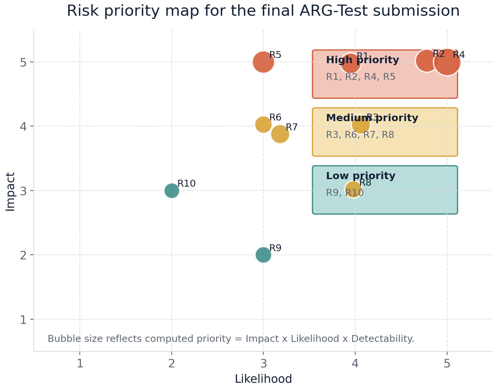

# Risk Analysis Report

## 1. Purpose and Shared Premise

This report is not a generic project-management risk list. It is a requirement-driven risk analysis for the final `ARG-Test` submission, centered on `FR/NFR compliance`, evidence traceability, and defense-time interpretability under the course-provided `Requirement_Specification.md`.

The shared team wording for the final phase is:

`Our final project is implemented and validated against the provided Requirement Specification of the AutoTestDesign AI App.`

Accordingly, the scope of this report covers:

- the requirement-driven `AutoTestDesign AI App` itself
- the canonical formal result source and its mirrored evidence
- the independent `final_docs/` package
- `demo_web/`, the demo package, and presentation/defense interpretation risks

At this stage, the main risks are no longer "the core system does not exist." They are now about whether the finished functionality, boundaries, and evidence are explained accurately, consistently, and defensibly.

## 2. Risk Scoring Method and Evidence Sources

### 2.1 Risk Scoring Method

Each risk is evaluated with three `1-5` dimensions:

- `Impact`: how much the risk would damage compliance, defensibility, or grading outcome
- `Likelihood`: how likely the risk is to occur given the current repository and document state
- `Detectability`: how difficult it is for the team to catch and correct the risk before submission

The final priority score is:

`Risk Priority = Impact x Likelihood x Detectability`

Priority bands used in this report:

- `High`: `>= 60`
- `Medium`: `36-59`
- `Low`: `<= 35`

### 2.2 Approved Evidence Sources

This report relies only on final-phase approved evidence sources:

- requirement baseline: `Requirement_Specification.md`
- canonical result root: `.local_runs/formal_qwen_novpn`
- repository-traceable mirrors: `report_assets/final_latex_report/` and `report_assets/final_demo_package/frontend_focus/formal_results_snapshot/`
- code and execution evidence: `src/`, `demo_web/`, `tests/`, `reference_impl/`, and `final_docs/execution_evidence/`
- final document and submission-process evidence: `final_docs/` and `report_assets/final_demo_package/`

### 2.3 Unified Final Numbers

Whenever the report, PPT, demo, or defense uses quantitative results, the team must use the following final numbers:

- dataset split: `dev = 50`, `test = 16`
- full pipeline: `avg checker score = 0.959`, `avg overall coverage = 0.615`, `avg test count = 7.312`
- baselines: Rule-based `0.753 / 0.147 / 4.125`; Plain LLM `0.844 / 0.030 / 7.250`; Structured No Checker `0.841 / 0.538 / 6.312`
- detailed executable evidence: `15 module tests passed`; `38 repo tests passed`; `100% statement coverage`; `100% branch coverage`; `4 / 4 mutants killed`

These numbers are grounded in `report_assets/final_latex_report/main.tex`, `final_docs/execution_evidence/`, and the formal demo snapshot, and must not be replaced by mock outputs or legacy repository leftovers.

## 3. Requirement-Specification Coverage View

The table below makes the framing explicit: the risks in this report are tied to `FR 1.0 ~ FR 7.0` and `NFR 4.1 ~ NFR 4.4`, not to arbitrary project commentary.

| Requirement | Current implementation or evidence closure | Related risks |
| --- | --- | --- |
| `FR 1.0` Input / Parsing | Supports requirement files, `run-text`, and `batch-csv`; see `src/main.py`, `src/input_loader.py`, and `extended_feature_smoke_summary.md`. | `R1`, `R6` |
| `FR 1.1` Requirement Structuring | Structured parsing is implemented through `src/parser.py`, `src/schemas.py`, and the structured trace format. | `R1`, `R2` |
| `FR 2.0` Risk Analysis & Prioritization | `src/risk.py` produces requirement-level `risk_assessment` plus case-level priority promotion. | `R1`, `R2` |
| `FR 3.0` Black-Box Test Design | Covers `EP`, `BVA`, `Decision Table`, and `State Transition`, with baseline, ablation, and final comparison evidence. | `R1`, `R2` |
| `FR 4.0` White-Box Test Modeling | In the final scope, this is realized as state-model extraction plus `All States` and `All Transitions` planning, with `coupon_discount_engine` providing executable white-box evidence. | `R3` |
| `FR 5.0` Test Oracle Generation | Final tables explicitly include `Expected Output`; repair, export, and execution evidence all depend on expected-result synthesis. | `R3`, `R6` |
| `FR 6.0` Output & Export | Supports `Markdown / JSON / CSV` export; see `src/exporter.py` and the formal output directories. | `R1`, `R6`, `R7` |
| `FR 7.0` Test Suite Optimization | Multi-candidate reranking, repair, and priority-aware refinement are implemented. | `R1`, `R2` |
| `NFR 4.1` Performance | Mock/local-path performance has been validated, but live runtime remains provider-latency-bound. | `R5` |
| `NFR 4.2` Usability / UI / Traceability | The primary defense workflow is the `demo_web/` FastAPI Web demo, with CLI and exported artifacts retained as the reproducibility and audit path. | `R4`, `R6`, `R8` |
| `NFR 4.3` Security | `.env`-based secret injection, manifests without API keys, and artifact secret scanning are in place. | `R9` |
| `NFR 4.4` Maintainability and Technology | The modular Python repo, architecture figure, README, final docs, and demo package together support this requirement. | `R6`, `R10` |

## 4. Priority Overview

Figure 1 shows the current final-submission posture clearly. The high-priority risks are concentrated around `Requirement coverage exposition`, `claim interpretation`, `UI boundary`, and `performance wording`, not around complete absence of functionality. That is the expected posture of a technically completed course project entering its final submission phase.

## 5. Risk Register

The full register is split into a compact scoring table and a mitigation summary. This keeps the PDF readable while preserving the same risk information.

| Risk ID | Anchor | Main risk focus | I/L/D | Priority | Band | Status |
| --- | --- | --- | --- | --- | --- | --- |
| `R1` | `FR 1.0~FR 7.0` | FR coverage may be undervalued if capabilities are not mapped to the specification. | `5/4/3` | `60` | High | Controlled |
| `R2` | `FR 2.0`, `FR 3.0`, `FR 7.0` | Metrics, baselines, and gold-spec usage may be misinterpreted. | `5/5/4` | `100` | High | Controlled |
| `R3` | `FR 4.0`, `FR 5.0` | FR 4.0 and the coupon module may be mistaken for full white-box automation. | `4/4/3` | `48` | Medium | Residual but defendable |
| `R4` | `NFR 4.2.1` | Web demo capability may be misinterpreted as a production SaaS frontend rather than a stable course-project demonstration surface. | `5/3/4` | `60` | High | Controlled with boundary |
| `R5` | `NFR 4.1.1`, `NFR 4.1.2` | Live-provider latency may make strict performance claims misleading. | `5/3/5` | `75` | High | Residual and accepted |
| `R6` | `NFR 4.2.2`, `NFR 4.4.3` | Traceability may weaken if paths, IDs, and wording drift. | `4/3/3` | `36` | Medium | Controlled |
| `R7` | result-source policy | Mixing formal, mock, and legacy outputs may weaken result authority. | `4/3/4` | `48` | Medium | Controlled |
| `R8` | demo interpretation | Ad hoc mock outputs may be cited as official benchmark evidence if the replay boundary is not explained. | `3/2/2` | `12` | Low | Controlled |
| `R9` | `NFR 4.3.1` | Secrets may accidentally enter screenshots, logs, or artifacts. | `2/3/4` | `24` | Low | Controlled |
| `R10` | `NFR 4.4.1~NFR 4.4.3` | Maintainability evidence may be undervalued if the evidence chain is fragmented. | `3/2/5` | `30` | Low | Controlled |

Mitigation and evidence summary:

- `R1`: Use explicit FR-coverage mapping in the risk report and test plan; key evidence includes `src/main.py`, `src/risk.py`, `src/state_model.py`, `src/exporter.py`, `final_docs/10_feature_closure_status_cn.md`, and `extended_feature_smoke_summary.md`.
- `R2`: Always report `0.959 / 0.615 / 7.312` together with the baselines; state that `checker_score != correctness` and that the `gold spec` is an evaluation rubric, not training data.
- `R3`: In the detailed document, separate the AutoTestDesign app feature under validation from the selected executable validation module; cite `src/state_model.py` and `coupon_discount_engine_execution_summary.md`.
- `R4`: State the UI boundary directly: the project has a stable `demo_web/` FastAPI Web demo for direct text, CSV, state-model, and formal-dashboard demonstration; CLI and exported artifacts remain the audit/reproduction path.
- `R5`: Split the performance claim into mock/local processing and live-provider latency; the latest NFR evidence records `100` local/mock requirement jobs in `1.1331 s`, an average of `0.0113 s / requirement`, and a maximum single-requirement time of `0.0187 s`.
- `R6`: Keep wording and paths synchronized across `README.md`, `final_docs/README.md`, `05_evidence_and_submission_checklist_cn.md`, and `report_assets/final_demo_package/`.
- `R7`: Anchor official results to `.local_runs/formal_qwen_novpn` and the formal result snapshot under `report_assets/final_demo_package/frontend_focus/formal_results_snapshot/`.
- `R8`: Explain during the demo that built-in formal examples use `frozen_formal_run` replay, while edited ad hoc inputs use local `mock` generation and must not be cited as official benchmark quality.
- `R9`: Keep secrets outside committed artifacts; manifests record provider metadata but not API keys, and artifact/report directories have been secret-scanned.
- `R10`: Present `src/`, `experiments/`, `tests/`, `final_docs/`, `demo_web/`, `38 passed`, the architecture figure, and the README as one maintainability evidence chain.

## 6. High-Priority Risk Analysis

### 6.1 `R1`: FR Coverage Exposition Risk

This is not a "missing feature" problem. It is a "finished features may still look unfinished if they are not explained against the requirement map" problem. The repository already supports:

- `FR 1.0`: `run`, `run-text`, `batch-csv`
- `FR 2.0`: risk scoring and priority promotion
- `FR 3.0`: `EP / BVA / Decision Table / State Transition`
- `FR 4.0`: state-model extraction, `All States`, and `All Transitions`
- `FR 5.0`: `Expected Output` synthesis
- `FR 6.0`: `Markdown / JSON / CSV` export
- `FR 7.0`: reranking, repair, and prioritization

The mitigation is therefore not to rebuild functionality, but to keep every final document aligned with the FR structure.

### 6.2 `R2`: Metric and Comparison Interpretation Risk

This is one of the most likely defense-time risks. The safest explanation is:

- `checker_score` measures contract consistency, not final correctness
- `overall_coverage` measures gold-spec obligation coverage and complements `checker_score`
- the `rule-based baseline` is our own deterministic heuristic non-AI baseline
- the `gold spec` is a manually derived evaluation rubric, not training data

If these statements stay consistent across the risk report, PPT, and demo script, `R2` remains a controllable interpretation risk rather than a technical flaw.

### 6.3 `R4`: UI Boundary Risk

`NFR 4.2.1` is one of the most sensitive non-functional items in this final project. The most accurate wording is:

- the primary defense interaction surface is the `demo_web/` Web demo backed by FastAPI
- it supports formal requirement selection, direct text input, CSV import, a formal-result dashboard, and state-model generation
- built-in formal examples replay the frozen formal outputs so that displayed coverage and selected cases match the official evidence root
- CLI commands and exported artifacts remain the reproducibility path rather than the main presentation surface
- it is a stable course-project demonstration UI, not a production SaaS frontend

This wording avoids both extremes: denying the UI entirely and overclaiming a mature web product.

### 6.4 `R5`: Performance Claim Risk

The performance section must not be written as if the project already satisfies an industrial live end-to-end SLA. The defensible conclusion is:

- the local/mock path is fast enough for course-project validation and demonstration
- actual live runtime is mainly constrained by provider latency
- the final evaluation emphasizes functionality, coverage, usefulness, and evidence-backed validation

This is more honest and more technically correct than simply repeating the hard numbers from the specification without qualification.

## 7. Medium-Priority Risks and Accepted Boundaries

### 7.1 `R3`: Interpreting `FR 4.0` and the Executable Module Correctly

This boundary should not be hidden; it should be explained clearly:

- `state-model extraction` is the direct `AutoTestDesign app` implementation for `FR 4.0`
- `coupon_discount_engine` is not the whole system
- its role is to show that the generated or curated test design can be translated into concrete black-box and white-box execution evidence

The supporting hard evidence is already strong:

- `15 passed`
- `38 passed`
- `100% statement coverage`
- `100% branch coverage`
- `4 / 4 mutants killed`

### 7.2 `R6` and `R7`: Traceability and Canonical Result-Source Risk

These two risks share the same root problem: the project has many materials, but it must maintain only one official final wording. The submission should therefore follow this discipline:

- the requirement source is always `Requirement_Specification.md`
- official numbers are always anchored to `.local_runs/formal_qwen_novpn`
- repository figures, the demo dashboard, and the LaTeX report are mirrors or re-presentations of that official source
- legacy `outputs/reports/test` snapshots must not be cited as final evidence

### 7.3 `R8`: Demo and Defense Misinterpretation Risk

The demo only needs to prove three things:

- the tool truly runs
- the outputs are truly structured
- the final project truly has formal results and executable evidence

It is not a live benchmark, and it is not a provider-determinism demonstration. If that explanation remains intact, the risk stays manageable.

The current Web demo reduces this risk by making the source of each displayed result explicit. For formal examples, the Direct and CSV tabs show frozen replay evidence from `report_assets/final_demo_package/frontend_focus/formal_results_snapshot/`; for edited ad hoc inputs, the UI labels the run as local mock generation. The state-model tab is also backed by a five-item workflow catalog whose legal transitions were checked by regression tests, avoiding the earlier empty-transition interpretation problem.

## 8. Honest Boundaries That Should Remain Visible

The following points should remain visible in the final submission rather than being polished away:

- the current UI is a stable Web demo plus the original CLI/audit workflow, not a polished standalone product frontend
- current performance evidence mainly proves that the local/mock path is fast enough; live latency remains provider-bound
- the project implements a seed-controlled pipeline, repeatability studies, and replay, but it must not claim that the upstream live provider is fully deterministic
- `checker_score` is not correctness itself, and the `gold spec` is not training data
- `coupon_discount_engine` is an executable usefulness anchor, not a substitute for the whole AutoTestDesign app

Keeping these boundaries explicit strengthens the credibility of the final submission.

## 9. Conclusion

From a final-submission perspective, the current risk posture of `ARG-Test` is positive. The core `FR` items and main `NFR` items are already supported by implementation and evidence, and the main remaining challenge is not "how to build a new system," but "how to avoid being misunderstood."

The highest-priority risks are concentrated in `FR coverage exposition`, `claim interpretation`, `UI boundary`, and `performance wording`, and each of these already has a clear mitigation path with repository-backed evidence.

Therefore, the conclusion of this report is not that the project is still highly risky. It is that `ARG-Test` has already reached a defensible final state, and that the remaining risks are controllable as long as the team keeps the same requirement-driven explanation framework across the documents, demo, PPT, and defense.
