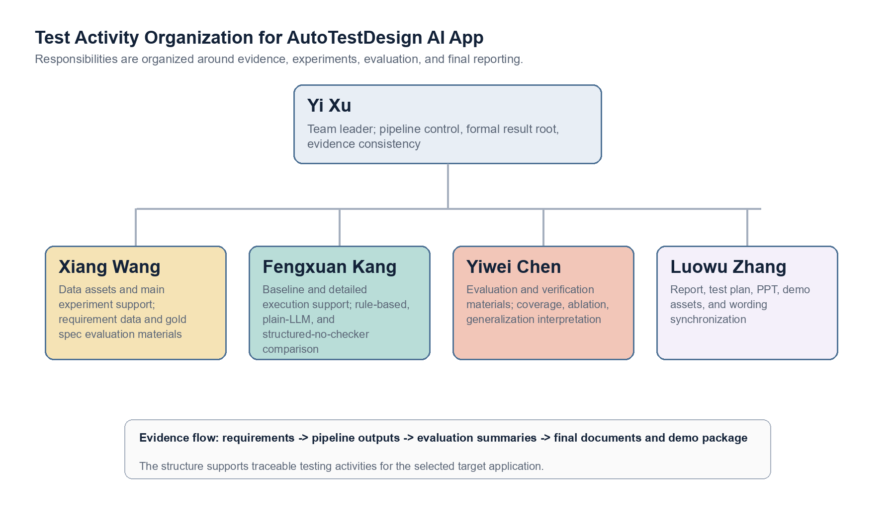

# Test Plan

## 1. Project Scope

### 1.1 Background

`ARG-Test` is the implementation workspace for the requirement-driven `AutoTestDesign AI App`. It converts natural-language requirements into structured and auditable black-box test suites. This final course project implements and verifies the `AutoTestDesign AI App` according to the teacher-provided `Requirement_Specification.md`. Therefore, the system under test in this test plan is explicitly the `AutoTestDesign AI App`, not a generic framework, a testing idea, or a standalone sample execution module.

The current deliverable is a prototype-level application interface built around the core pipeline. The system provides a stable FastAPI-backed Web demo as the primary final-defense interaction surface, while keeping CLI commands and exported artifacts as the reproducibility and audit path. Direct text input, CSV batch input, file input, state-model extraction, formal-result viewing, and structured export together form the currently usable interface. This project does not claim to have delivered a fully polished standalone frontend product.

This final project extends the midterm prototype into a submit-ready version. The extension is not merely the addition of isolated features. It connects requirement structuring, risk analysis and prioritization, multi-technique black-box test generation, state-model extraction, and sequence planning into an auditable pipeline. At the same time, the project adds detailed executable evidence for one major module and builds an evidence chain for non-functional verification, result reproduction, and archive replay to support the final submission.

### 1.2 Objectives

The objective of this final project is to generate requirement-driven test cases in a structured and reviewable form so that the outputs can align with classical test design techniques rather than relying only on free-form prompt generation. The system also needs to provide risk-aware priorities so that testing work can cover high-risk requirements first, and it needs to export test cases, test suites, risk information, and summary results as reusable standard artifacts. At the delivery level, this project uses one selected module to demonstrate both black-box and white-box execution evidence, ultimately forming a submission package that is auditable, presentable, and defensible in Q&A.

### 1.3 In-Scope and Out-of-Scope Content

The scope of this plan covers ingesting requirements from files, direct text, and CSV batch input, followed by trace generation, parsing, checking, reranking, repair, risk scoring, and export. Interface verification covers the lightweight Web demo and the CLI-based prototype workflow. The experimental scope includes comparison against rule-based, plain-LLM, and structured-no-checker baselines. In addition, `coupon_discount_engine` is used as the executable anchor for detailed design and execution verification, showing that generated or organized test designs can further be grounded in concrete execution evidence.

This plan does not cover industrial-scale load testing, nor does it conduct large-scale UI usability research for external users. Because the current deliverable is positioned as a course project prototype, full frontend product polishing is outside the scope of this plan. At the same time, this plan does not promise full determinism at the upstream provider layer. Instead, it controls the consistency of formal evidence through frozen results and replay mechanisms.

## 2. Test Items

### 2.1 Functional Requirement Test Items

The following table directly maps the formal `Requirement_Specification.md`. It is the main scope control table for functional testing of the `AutoTestDesign AI App`.

| Requirement ID | Test Item | Test Content | Main Repository Module/Evidence |
| --- | --- | --- | --- |
| `FR 1.0` | Requirement input and parsing | The App can ingest requirements from CSV, plain text files, and direct user input, then pass normalized content to the downstream pipeline. | `src/main.py`, `src/input_loader.py`, `run-text`, `batch-csv`, file batch processing runs |
| `FR 1.1` | Requirement structuring | Raw requirement text can be parsed into testing-related structured elements, such as inputs, ranges, conditions, actions, and expected behavior. | `src/parser.py`, parsed trace artifacts, checker diagnostics |
| `FR 2.0` | Risk analysis and priority ranking | Each imported requirement can receive risk information and priority signals usable for ordering testing work. | `src/risk.py`, final summaries, the `risk` field in exported artifacts |
| `FR 3.0` | Black-box test design | The App can generate and check test cases for at least three ISO29119-4 black-box techniques: Equivalence Partitioning, Boundary Value Analysis, and Decision Table Testing. Workflow requirements also cover state transition cases. | `src/checker/`, `src/pipeline.py`, final test suites, checker score and coverage summaries |
| `FR 4.0` | White-box test modeling/state behavior modeling | The App can extract state models, legal/illegal transitions, and sequence plans for coverage criteria such as all states and all transitions. | `src/state_model.py`, `state-model` command output, state-model demo artifacts |
| `FR 5.0` | Test oracle generation | Generated cases include expected results or oracle-like expected behavior that can be reviewed and converted into executable checks. | `src/pipeline.py`, exported final tests, `coupon_discount_engine` execution evidence |
| `FR 6.0` | Output and export | The App can export test artifacts, test suites, risk scores, summaries, and manifests in structured formats such as Markdown, JSON, and CSV. | `src/exporter.py`, `outputs/final_tests/`, `.local_runs/formal_qwen_novpn`, final document figures |
| `FR 7.0` | Test suite optimization | The system can select better candidate outputs through reranking, repair, and priority control, so that the selected suite improves coverage and usability compared with weaker baselines. | `src/reranker.py`, `src/repair.py`, baseline comparison, ablation results |

### 2.2 Non-Functional Requirement Test Items

| Requirement ID | Test Item | Test Interpretation in This Final Project | Main Evidence |
| --- | --- | --- | --- |
| `NFR 4.1.1` | Batch analysis performance | Validate the controlled local/mock path against the teacher's "100 requirements within 5 seconds" threshold. The latest NFR run processes 100 requirement jobs in `1.1331 s`. Live provider latency is still treated as an external variable and is not used for the deterministic threshold claim. | `final_docs/execution_evidence/nfr_validation_summary.md`, mock run checks, final report interpretation |
| `NFR 4.1.2` | Single-requirement case generation time | Validate the controlled local/mock path against the "single requirement within 2 seconds" threshold. The latest maximum single-requirement time is `0.0187 s`, so the local path satisfies the threshold with a large margin. | `final_docs/execution_evidence/nfr_validation_summary.md`, demo runs, formal run metadata |
| `NFR 4.2.1` | Interface usability | Verify the current prototype interface: a FastAPI Web demo covering formal requirement selection, direct text, CSV batch, state-model generation, formal-dashboard viewing, and output inspection. CLI commands remain the reproducibility path. This is a stable demo interface, not a production frontend product. | `demo_web/app.py`, `demo_web/static/`, `tests/test_demo_web_api.py`, CLI commands, exported artifacts |
| `NFR 4.2.2` | Traceability | Confirm that generated test cases can be traced back to original requirement IDs, design techniques, checker diagnostics, and exported summaries. | Markdown/JSON/CSV exports, manifests, final result package |
| `NFR 4.3.1` | Security and data handling | Check that final artifacts do not leak API keys or other secrets, and treat requirement data as local course project artifacts. | Secret-leak scan, manifest review, `.env.example` separation |
| `NFR 4.4.1` | Technology stack | Confirm that the implementation uses an open Python technology stack suitable for AI integration, testing scripts, and Web/CLI demos. | `src/`, `experiments/`, `demo_web/`, `pytest`, `coverage.py` |
| `NFR 4.4.2` | Modularity | Confirm low coupling among input loading, provider access, parsing, checking, risk scoring, state modeling, reranking, repair, and export. | Repository module structure, regression tests |
| `NFR 4.4.3` | Documentation | Confirm that the final package includes the architecture figure, README usage instructions, final documents, demo materials, and evidence paths. | `README.md`, architecture figure, `final_docs/`, `report_assets/final_demo_package/` |

### 2.3 System Architecture and Main Components


The system architecture is centered on a requirement-driven pipeline:

1. Ingest requirements from files, direct text, or CSV.
2. Generate multiple structured traces.
3. Parse and verify each candidate output.
4. Rerank or repair when necessary.
5. Add risk and state-model metadata to the selected output.
6. Export the final test suite and aggregate reports.

The main components are separated according to pipeline responsibilities. `src/main.py` serves as the CLI entry point and connects user commands to concrete workflows. `src/pipeline.py` orchestrates generation, checking, candidate selection, and result enhancement. `src/llm_client.py` encapsulates the model-call logic for interacting with the provider. `src/parser.py` parses structured traces into typed objects that downstream modules can process. Testing-theory constraints are mainly implemented by `src/checker/`. Candidate control is handled by `src/reranker.py` and `src/repair.py`. Risk-scoring logic is centralized in `src/risk.py`. State extraction and coverage-plan generation are centralized in `src/state_model.py`. Finally, `src/exporter.py` exports test artifacts, while `src/evaluation/metrics.py` handles coverage and checker-based evaluation.

## 3. High-Level Test Strategy

The overall strategy is risk-aware and evidence-driven. High-risk business rules and workflow requirements receive stronger testing attention in the main experiments and detailed execution module.

### 3.1 Test Suites

| Suite ID | Suite Name | Objective | Main Technique | Evidence |
| --- | --- | --- | --- | --- |
| A | Functional pipeline verification | Verify end-to-end generation, parsing, checking, reranking, repair, and export. | Integration testing, scripted system checks | `experiments/run_main.py`, report package |
| B | Output quality evaluation | Measure checker score, overall coverage, duplicates, and diagnostics on frozen test requirements. `gold spec` is used only as a manually defined evaluation rubric. It is not training data and is not fed into the real generation pipeline. | Gold-spec-based evaluation | `.local_runs/formal_qwen_novpn`, formal summary tables |
| C | Baseline comparison | Compare the full pipeline against non-AI and weaker AI alternatives. | Controlled comparative experiment | Baseline summary and main comparison in `.local_runs/formal_qwen_novpn` |
| D | Ablation experiment | Isolate the effect of checker-guided control relative to structure-only generation. | Component ablation | Ablation results in `.local_runs/formal_qwen_novpn` and main report Section 6.4 |
| E | Detailed module execution | Demonstrate black-box plus white-box test design for a selected major module. | EP, BVA, decision table, white-box branch testing | `coupon_discount_engine` evidence |
| F | NFR and reproducibility verification | Check maintainability, usability, stability, and final package replay capability. | Regression testing, manifest checks, repeatability runs | `final_docs/execution_evidence/` |

### 3.2 Test Technique Selection by Risk

| Requirement Category | Risk Profile | Selected Technique | Rationale |
| --- | --- | --- | --- |
| Input validation with thresholds | High boundary and rejection risk | EP + BVA | Strengthen partition and boundary obligations. |
| Business rules with multiple interacting conditions | High rule-combination risk | EP + decision table + targeted BVA | Suitable for rule combinations and amount thresholds. |
| Workflow/state behavior | High transition and illegal-path risk | State-transition testing + negative transition checks | Must cover both legal and illegal transitions. |
| Selected detailed module | High executable-evidence value | EP + BVA + decision table + white-box branch testing | Satisfies the final project requirement for both black-box and white-box evidence. |

### 3.3 Interface Verification Strategy

Because the formal requirements mention the application UI, this plan treats the interface as a necessary test item while accurately explaining the current deliverable form. The `AutoTestDesign AI App` provides a Web demo for final demonstration and a CLI/artifact workflow for repeatable verification. The concrete interface paths cover direct requirement selection and direct text input, CSV batch requirement import, file-based requirement batch processing, state-model generation, formal-result dashboard viewing, and structured artifact viewing through Markdown, JSON, CSV, and summary outputs.

The acceptance objective is not frontend visual polish. It is that the user can input requirements, run supported workflows, inspect generated test artifacts, and trace outputs to requirement IDs and design techniques. For built-in formal samples, the Web demo must replay the frozen formal result instead of generating unrelated mock metrics; for edited ad hoc inputs, it must clearly show that the result is local mock generation rather than official benchmark evidence.

The following Web demo consistency checks are therefore part of the final acceptance strategy:

| Interface path | Acceptance check | Required outcome |
| --- | --- | --- |
| Direct requirement input | Select any of the 16 formal test requirements and run the Direct tab. | UI reports `frozen_formal_run` and matches the official formal coverage/checker score. |
| CSV upload | Upload rows matching formal test requirements. | Matching rows replay frozen formal results; non-matching ad hoc rows are labeled as mock-generated. |
| State-model extraction | Select each of the 5 workflow examples. | Every catalog workflow produces at least one legal transition; illegal transitions are shown when explicitly present in the requirement. |
| Formal evidence dashboard | Open the Formal Evidence tab. | Dashboard shows the canonical final test-set aggregates, including average overall coverage `61.5%`. |

### 3.4 Test Plan Evidence Chain and Traceability Path

To align with the "rules to tests to results" evidence chain in the detailed test design and execution document, this test plan also uses a centralized traceability method to manage plan items, verification activities, and evidence sources. The test plan itself does not treat temporary mock outputs as formal experimental conclusions. Formal quality judgments preferentially reference `.local_runs/formal_qwen_novpn`, `final_docs/`, `final_docs/execution_evidence/`, and final demo/report materials. Because `.local_runs` is usually a local frozen runtime directory, if the submission package does not directly contain that directory, the formal result snapshot in `report_assets/final_demo_package/frontend_focus/formal_results_snapshot/` is used as the accessible archived evidence.

| Plan Item | Corresponding Requirement or Risk | Verification Activity | Main Evidence Path |
| --- | --- | --- | --- |
| Input and parsing capability | `FR 1.0`, `FR 1.1` | Execute direct text, CSV batch, and file batch processing inputs, and check whether the structured trace is consistent with downstream pipeline input. | Commands in `README.md`, `src/input_loader.py`, `src/parser.py`, `.local_runs/formal_qwen_novpn` |
| Risk scoring and priority | `FR 2.0`, risk-based testing objective | Check whether exported results include risk information and confirm that test suite ordering reflects high-risk requirements first. | `src/risk.py`, formal summaries, risk and coverage interpretation in the final report |
| Black-box technique generation | `FR 3.0` | Check whether EP, BVA, Decision Table, and State Transition obligations are recognized by the checker and reflected in the final test suite. | `src/checker/`, `src/pipeline.py`, `.local_runs/formal_qwen_novpn`, checker score/coverage summaries |
| State model and sequences | `FR 4.0` | Run the state-model path and check whether states, legal/illegal transitions, and coverage sequences are structurally exported. | `src/state_model.py`, state-model demo artifacts, `report_assets/final_demo_package/` |
| Oracle and executable anchor | `FR 5.0` | Check whether generated cases contain expected results, and use `coupon_discount_engine` to show that test design can be converted into execution evidence. | `final_docs/execution_evidence/`, `reference_impl/`, `tests/` |
| Output and export | `FR 6.0` | Check whether Markdown, JSON, CSV, manifests, and summaries can be traced to requirement IDs and technique types. | `src/exporter.py`, `outputs/final_tests/`, `.local_runs/formal_qwen_novpn` |
| Optimization and comparison | `FR 7.0` | Compare full pipeline, rule-based, plain-LLM, and structured-no-checker, and explain the contribution of rerank/repair. | `.local_runs/formal_qwen_novpn`, baseline summary, ablation summary |
| NFR boundary | `NFR 4.1~4.4` | Separately check performance boundaries, interface usability, security, modularity, and documentation evidence, avoiding overclaims about provider behavior and UI maturity. | `README.md`, `demo_web/`, `.env.example`, `final_docs/`, `report_assets/final_demo_package/` |

The role of this evidence chain is to tighten the test plan from a chapter-style explanation into a traceability control document. Each test item can be mapped to a requirement or risk source, a verification activity in the plan, and an evidence location that can finally be cited in the report, demo, or Q&A.

## 4. Test Levels and Goals

| Test Level | Goal | Typical Assets | Exit Condition |
| --- | --- | --- | --- |
| Unit | Verify helper functions, parser behavior, and checker logic. | Targeted Python tests | No critical unit failure |
| Integration | Verify that generated traces flow correctly through parsing, checking, repair, and export. | Pipeline scripts and intermediate artifacts | Full pipeline has no structural failure |
| System | Verify complete requirement-to-suite behavior on the frozen evaluation set. | Formal report bundles | Canonical summaries are generated successfully |
| Acceptance | Verify that the final package can support the report, PPT, demo, and Q&A. | `final_docs`, figures, report assets, Web demo screenshots, evidence summaries | All referenced artifacts exist and are traceable; Web demo replay and state-model consistency tests pass |

## 5. Schedule and Checklist

The project schedule is organized by deliverable phases rather than isolated coding tasks.

| Phase | Main Work | Deliverable | Expected Status |
| --- | --- | --- | --- |
| Phase 1 | Freeze the midterm baseline, migrate final materials into the main repository, and confirm canonical result roots. | `final_docs/`, `frozen_middle/`, evidence source map | Completed before final writing |
| Phase 2 | Close functional gaps such as risk scoring, CSV/direct input, state-model closure, and reproducibility controls. | Upgraded pipeline and manifests | Completed before formal report writing |
| Phase 3 | Implement detailed module evidence, run coverage and mutation checks, and refresh figures. | Executable evidence and report-ready figures | Completed before document finalization |
| Phase 4 | Complete standalone documents, align report/PPT wording, and prepare the submission package. | Report PDF, test-plan PDF, risk-report PDF, detailed-execution PDF | Pre-submission stage |
| Phase 5 | Final consistency review and demo preparation. | PPT PDF, demo video, compressed scripts | Final delivery stage |

The pre-submission consistency checklist focuses on evidence sources and narrative wording. All cited numbers should come from canonical result roots. The final report, risk report, test plan, and detailed execution document need to use the same terminology. Detailed module evidence paths must be reachable from the repository. Examples used in the PPT and demo should also stay consistent with the report, avoiding conflicts in evidence paths or project interpretation during final Q&A.

## 6. Organization Structure and Responsibilities

The organization structure in this test plan is not simply a personnel list. It describes the responsibility flow formed around testing activities for the `AutoTestDesign AI App`. The team leader is responsible for unifying the requirement source, pipeline, and evidence root. The report and presentation owner converts testing evidence into final documents and defense materials. The data, baseline, evaluation, and detailed execution support members respectively maintain input assets, controlled experiments, evaluation interpretation, and executable evidence.



```text
Yi Xu / Team Leader and Integration Control
- Pipeline control, formal result root, evidence consistency
- Xiang Wang / Data assets and main experiment support
  - Requirement data, gold spec evaluation materials, main experiment input maintenance
- Fengxuan Kang / Baseline and detailed execution support
  - Rule-based, plain-LLM, structured-no-checker comparison and module execution support
- Yiwei Chen / Evaluation and verification materials
  - Coverage, ablation, generalization, and verification interpretation
- Luowu Zhang / Report, PPT, and demo assets
  - Final report, test plan, PPT, demo materials, and wording synchronization
```

| Member | Student ID | Main Responsibility |
| --- | --- | --- |
| Yi Xu | 2351441 | Team leader; final integration, pipeline control, evidence consistency, final merge |
| Luowu Zhang | 2352746 | Final report editing, PPT production, demo assets |
| Xiang Wang | 2351039 | Dataset maintenance and main experiment support |
| Fengxuan Kang | 2350283 | Baseline support and detailed module execution support |
| Yiwei Chen | 2350217 | Evaluation support, ablation/generalization support, verification materials |

This organization structure is important to the final package because the submission is not only code. It also includes formal documents, evidence paths, and demo assets, all of which must stay mutually consistent.

## 7. Test Framework and Selection Rationale

### 7.1 Main Framework

`pytest` is the main execution framework for the detailed module and repository regression checks.

The reason for selecting `pytest` is that it directly matches the Python repository structure of this project, has low usage cost, and makes it easy to reproduce experiments and regression checks on other machines. It naturally integrates with `coverage` and supports selective execution by directory, file, or test marker. Therefore, it is suitable for carrying black-box cases, white-box cases, and repository-level regression tests at the same time.

### 7.2 Supporting Tool Chain

| Tool | Usage |
| --- | --- |
| `coverage.py` | Collect statement coverage and branch coverage. |
| Repository scripts in `experiments/` | Orchestrate formal experiments, baselines, repeatability, and figure generation. |
| JSON/CSV/Markdown export | Provide checkable and reusable structured outputs. |

## 8. Cost Estimation

Cost estimation uses person-days plus tool/runtime overhead rather than a vague description.

| Work Item | Estimated Workload |
| --- | --- |
| Repository reorganization and baseline freeze | 1.0 person-day |
| Final feature upgrade and verification | 2.0 to 3.0 person-days |
| Risk analysis and test plan drafting | 1.0 to 1.5 person-days |
| Detailed module implementation and execution | 2.0 person-days |
| Figure generation, report polishing, and package consistency review | 1.5 to 2.0 person-days |
| PPT, demo, and final packaging | 1.0 to 1.5 person-days |

Based on the work items above, the overall workload is estimated at `8.5 to 11.0 person-days`. API and runtime costs are expected to be moderate, mainly controlled by freezing formal results, reusing generated artifacts, and using replay-based verification.

From the perspective of using the `AutoTestDesign AI App` for testing activities, cost savings mainly come from automation in test design, risk ordering, formatted export, and result summarization rather than the complete removal of human review. Human work is still needed to confirm whether requirement interpretation is reasonable, inspect key boundaries and business combinations, prepare defense materials, and maintain formal evidence paths.

| Activity | Main Cost in Manual Testing | Cost Change After Using AutoTestDesign |
| --- | --- | --- |
| Requirement decomposition and test item identification | Requires manual reading of each requirement and extraction of inputs, conditions, boundaries, and expected behavior. State or combination rules are easy to miss. | Parser, structured trace, and checker help form candidate test items. Humans mainly review and correct them, reducing design preparation time. |
| Black-box technique application | EP, BVA, Decision Table, and State Transition need to be manually applied, creating much repetitive work. | The tool automatically generates and checks technique obligations. Humans focus on confirming high-risk requirements and exceptional cases, reducing mechanical design cost. |
| Risk ordering | Requires manual risk estimation and maintenance of a priority table. | `src/risk.py` and exported results provide a unified risk field. Humans handle interpretation and final confirmation. |
| Export and traceability | Manually maintaining Markdown, JSON, CSV, and summaries can easily cause path or ID inconsistencies. | `src/exporter.py` exports artifacts consistently, making requirement IDs, technique types, and risk information easier to trace. |
| Result reproduction and defense preparation | Manually reproducing experiments and finding evidence paths is time-consuming. | Evidence sources are fixed through `.local_runs/formal_qwen_novpn`, `final_docs/`, and the demo package, reducing final integration cost. |

Therefore, the cost estimate of this project is not "AI replaces all testers". It is "the tool reduces repetitive test design and artifact organization cost, while humans remain responsible for requirement interpretation, evidence review, and defense explanation". This is also consistent with the positioning of the course project: verifying that the `AutoTestDesign AI App` can make the requirement-driven test design process more structured and more traceable, rather than claiming complete automation of real industrial testing.

## 9. Exit Criteria

When the canonical formal result bundle has been fixed and is fully traceable, and when the final report, risk report, test plan, and detailed execution document have all been completed, this test plan reaches the basic delivery condition. On this basis, the selected major module also needs to have black-box and white-box execution evidence, and NFR and reproducibility evidence must be locatable and explainable. The final submission package should support the demo and Q&A, and should not contain confusion about result sources, file paths, or the interpretation of the system under test.

The final exit criteria also include Web demo consistency: all 16 formal Direct-tab examples replay frozen results, the CSV sample can replay matching formal rows, all 5 workflow catalog examples produce non-empty legal-transition state models, and the repository regression suite passes with `38 passed`.

## 10. Conclusion

This test plan is not a minimal course description. It is a control document bound to concrete repository assets, formal evidence roots, clear responsibilities, and exit criteria. It explains how to test the `AutoTestDesign AI App` and also ensures that the final deliverables stay consistent in requirement source, experiment wording, evidence paths, and defense explanation.
