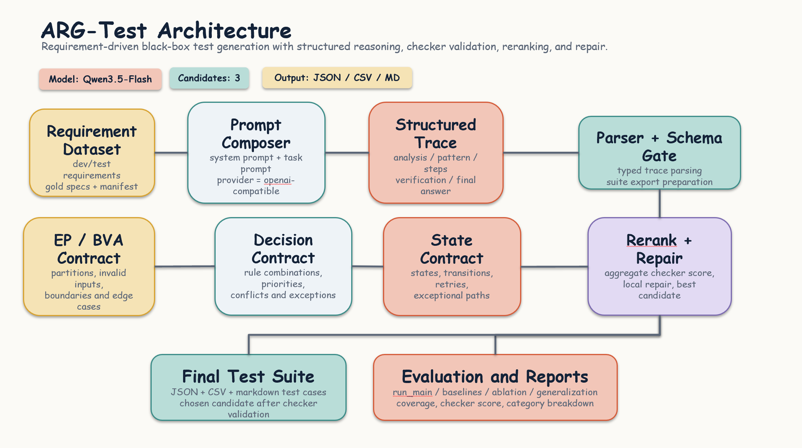
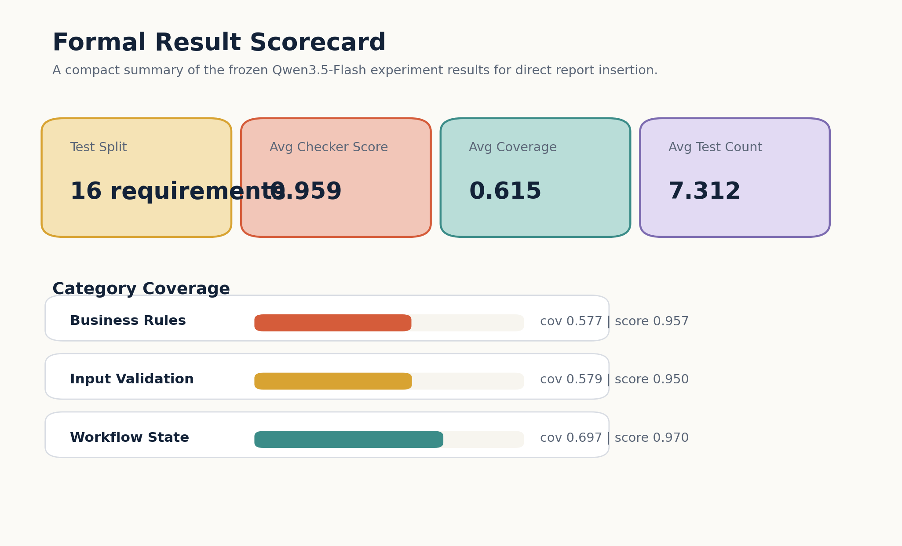
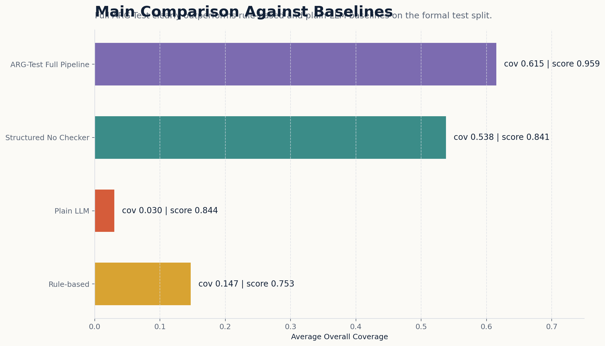
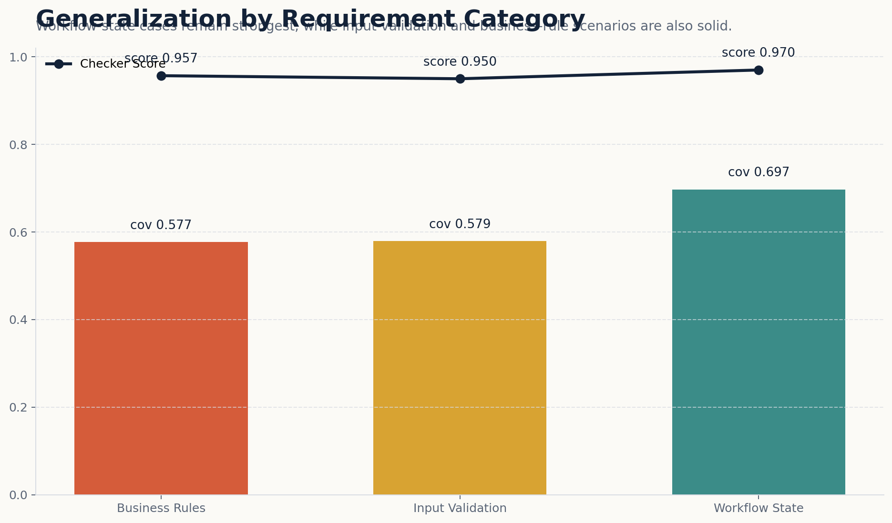
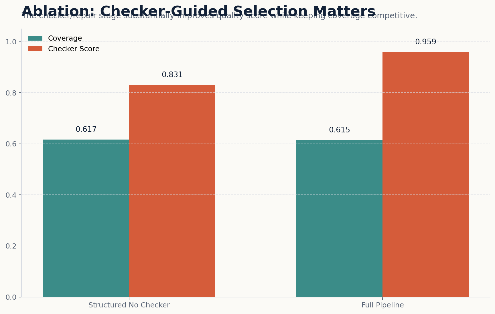
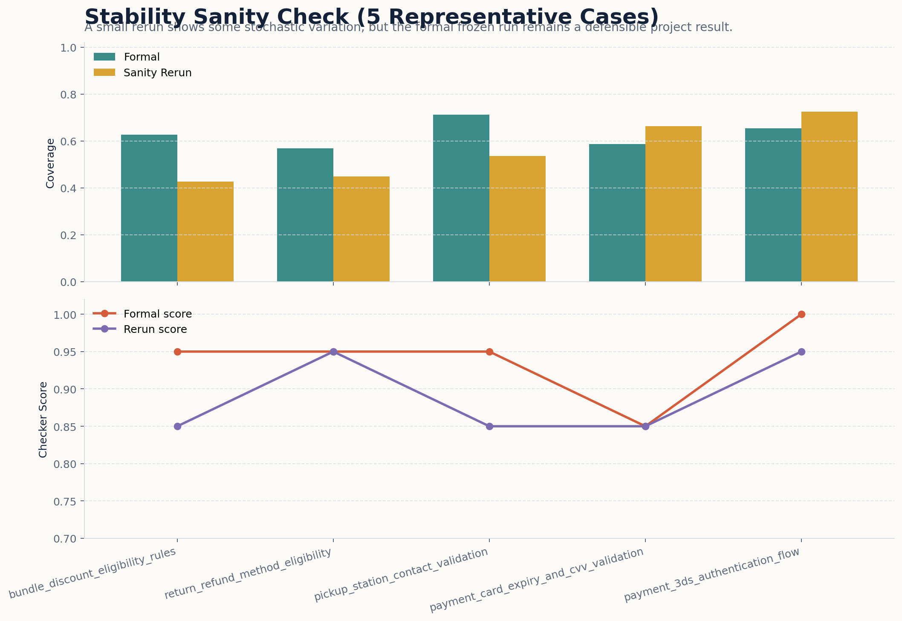
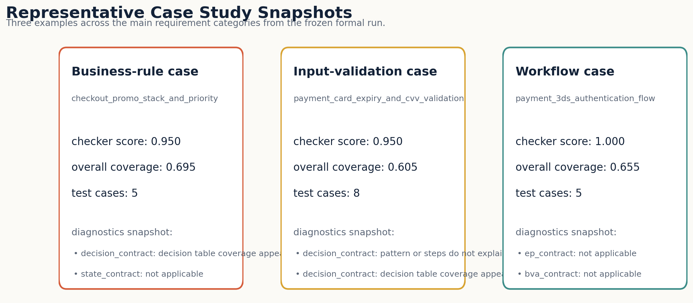

# ARG-Test: Auditable Requirement-Driven Black-Box Test Generation with Structured LLM Reasoning and Contract Verification

**Team ID:** TBD  
**Members:** Xu Yi, Zhang Luowu, and three teammates (fill full names before submission)  
**Student IDs:** TBD  
**Course Artifact Type:** AI-Enhanced Software Testing Submission Artifact  

---

## Abstract

This report presents **ARG-Test**, an AI-enhanced black-box testing tool that converts natural-language software requirements into auditable test suites. The assignment allows either requirement documents or codebases as input; in this project we fully implement the **system-requirement-driven** branch and focus on black-box dynamic testing. The core problem is that plain large language model prompting can generate plausible test cases, but it often hides the reasoning process, misses invalid classes or boundary cases, and makes it difficult to verify whether the generated suite actually follows classical testing techniques. To address this problem, ARG-Test forces the model to produce a **five-section structured testing trace** consisting of `Analysis`, `Pattern`, `Steps`, `Verification`, and `FinalAnswer`, and then validates the trace using technique-specific contracts for Equivalence Partitioning, Boundary Value Analysis, Decision Table Testing, and State Transition Testing.

The final system contains a prompt builder, structured generator, parser, contract checkers, candidate reranker, repair module, exporter, and experiment scripts. We evaluate the method on an internally curated requirement dataset with **50 development requirements** and **16 held-out test requirements** covering input validation, business-rule logic, and workflow behavior. The final frozen result on the test split achieves an **average checker score of 0.959** and an **average overall coverage of 0.615**, while the best non-AI baseline reaches only **0.147** coverage and a plain LLM baseline reaches **0.030** coverage. We also run ablation and stability sanity-check experiments to understand both the strengths and the practical limitations of the approach. These results show that ARG-Test is not just a prompt, but a complete and auditable AI testing pipeline that satisfies the assignment requirements and substantially exceeds a minimal course-project implementation.

---

## 1. Introduction

Requirement-driven black-box testing is a meaningful testing task because many real projects start from requirement documents long before a stable codebase or executable oracle is ready. At that stage, testers still need to derive valid partitions, invalid partitions, boundary values, rule combinations, and workflow transitions from natural-language descriptions. If this early test design is weak, later implementation testing will inherit the omissions.

Large language models are attractive for this task because they can quickly read textual requirements and propose test cases. However, direct prompting is not enough for a rigorous software-testing workflow. A plain model output may look fluent while still missing illegal input classes, skipping just-below or just-above boundary points, or mixing several testing techniques without explaining why they were selected. These problems are especially serious in a course assignment that explicitly requires analysis of coverage, usefulness, and limitations rather than only a list of generated outputs.

Our solution is **ARG-Test**, a requirement-driven AI black-box testing pipeline that turns hidden reasoning into an auditable artifact. Instead of asking the model to directly output test cases in free form, ARG-Test first requires a structured testing trace. The trace is then parsed, checked, reranked, and optionally repaired before the final test suite is exported. This design follows the key philosophy of the course reference paper: reasoning should not remain opaque if we want to inspect and improve it.

This project contributes in four concrete ways. First, it defines a five-section structured testing trace for requirement-to-test generation. Second, it implements technique-aware contracts that operationalize EP, BVA, Decision Table Testing, and State Transition Testing. Third, it integrates candidate reranking and targeted repair so that the best trace is selected rather than trusting a single sample. Fourth, it provides a full experiment suite with baseline comparison, ablation, category-level generalization analysis, and a small stability sanity check. Because of this end-to-end design, the project satisfies the assignment at a level significantly above a minimal prompt-only baseline.

---

## 2. Background and Related Concepts

This project is grounded in four standard black-box testing techniques. **Equivalence Partitioning (EP)** divides the input space into representative valid and invalid classes. **Boundary Value Analysis (BVA)** focuses on values at, just below, and just above important limits. **Decision Table Testing** captures combinations of conditions and actions for business rules. **State Transition Testing** targets systems whose behavior depends on current state and legal or illegal transitions. These techniques are standard in software testing, but manually deriving them from natural-language requirements can be slow and inconsistent.

Traditional non-AI automation usually works only when requirement patterns are simple and explicit. For example, a rule-based script can often detect numeric ranges or mandatory fields, but it struggles when a requirement combines multiple constraints, workflow states, or implicit business logic. On the other hand, a plain LLM can read richer language, but it does not automatically provide the traceability and verification needed for a testing tool. The gap between fluency and auditability is therefore the key motivation of this work.

ARG-Test is designed to bridge that gap rather than replace classical testing concepts. The project does not invent a new testing theory. Instead, it uses AI to recover classical black-box techniques from requirements, while adding parser- and checker-based control so the result is inspectable, explainable, and experimentally analyzable.

---

## 3. Problem Definition and Scope

### 3.1 Assignment-Compliant Problem Setting

The assignment requires a tool that uses AI methods for software testing and accepts one of two input types: **system requirements** or **testing codebase**. Our project deliberately implements the **system-requirement input** branch. This is fully compliant with the task specification and is the most natural fit for black-box testing.

### 3.2 Input, Output, and Objectives

**Input.** The tool takes a natural-language requirement document describing a software feature, rule set, or workflow. In this project, the requirements are written in a realistic e-commerce and service-platform style.

**Output.** The tool produces five artifact layers:

1. A structured reasoning trace with `Analysis`, `Pattern`, `Steps`, `Verification`, and `FinalAnswer`.
2. A normalized final test suite exported as Markdown, JSON, and CSV.
3. Parser and checker artifacts for auditability.
4. Summary metrics for each requirement.
5. Aggregate experiment reports for baseline comparison, ablation, category-level generalization, and stability.

**Objectives.** The project targets four objectives:

1. Generate more complete black-box test suites from requirements.
2. Make model reasoning auditable rather than opaque.
3. Compare AI and non-AI methods fairly.
4. Document AI limitations and practical mitigation steps.

### 3.3 Scope Boundaries

The project does **not** implement a full codebase-driven white-box or static-analysis branch. It also does not claim formal semantic correctness. Instead, it aims at **auditable requirement-driven test generation** with explicit testing-technique coverage and reproducible artifacts.

---
## 4. Method Overview

ARG-Test uses a modular pipeline that separates generation, checking, selection, and export. The method is intentionally designed as a testing tool rather than as a single prompt.



*Figure 1. The full pipeline starts from requirement documents and gold specifications, produces multiple structured candidate traces, validates them with schema and technique-aware contracts, selects or repairs the best candidate, and exports final test artifacts together with experiment summaries.*

### 4.1 Structured Testing Trace

The central representation is a five-section trace:

- **Analysis** extracts entities, constraints, fields, rules, states, and exceptions.
- **Pattern** selects black-box testing techniques and justifies why they fit the requirement.
- **Steps** explains how partitions, boundaries, rules, or transitions are derived.
- **Verification** cross-checks the trace against earlier steps.
- **FinalAnswer** outputs the final test-case table in a machine-readable markdown format.

This structure makes the output auditable. If the model claims to use BVA, the trace must expose which boundaries were chosen. If it claims State Transition Testing, the trace must show states, triggers, and blocked transitions. This turns hidden reasoning into a checkable interface.

### 4.2 Prompting Strategy

The prompting strategy has four layers: a system prompt, a main generation prompt, a plain-LLM baseline prompt, and a repair prompt. The system prompt enforces black-box testing and the exact five-section schema. The generation prompt injects the requirement and output template. The repair prompt preserves valid content and revises only the failed parts after checker diagnostics. The plain baseline prompt intentionally removes the structural constraints so we can measure what structure adds.

### 4.3 Parser and Schema Gate

The parser converts raw model output into a typed internal representation. This stage verifies whether the required sections exist, whether the final table is parseable, and whether required fields such as expected output are present. The parser therefore acts as the first deterministic quality gate before testing-theory contracts are applied.

### 4.4 Technique-Specific Contracts

ARG-Test implements one schema checker and four technique-aware checkers.

- **EP checker:** looks for valid and invalid partitions.
- **BVA checker:** checks lower-boundary, on-boundary, and upper-boundary style coverage.
- **Decision checker:** validates rule-oriented cases and rule mapping.
- **State checker:** validates states, legal transitions, illegal transitions, and exceptional paths.

These checkers do not claim full semantic proof. Their purpose is to verify whether the generated trace is consistent with the chosen testing logic.

### 4.5 Candidate Reranking and Repair

The final model output is selected from multiple candidates rather than from a single generation. Each candidate receives a score based on checker outcomes and duplicate penalties. If the best candidate still remains below the desired quality threshold, the system applies targeted repair while preserving valid test cases. This design addresses one of the main practical issues of LLM-based tools: output variance across runs.

---

## 5. Implementation

### 5.1 Repository Modules

**Table 1. Main implementation modules.**

| Module | Role | Main Files |
| --- | --- | --- |
| Prompt construction | compose structured and baseline prompts | `prompts/`, `src/pipeline.py` |
| LLM client | call the external model provider | `src/llm_client.py` |
| Parser and schemas | parse typed traces and final tables | `src/parser.py`, `src/schemas.py` |
| Checker suite | schema, EP, BVA, decision, state checks | `src/checker/` |
| Reranking and repair | select best candidate and revise weak traces | `src/reranker.py`, `src/repair.py` |
| Evaluation | compare generated suites against gold specs | `src/evaluation/metrics.py` |
| Experiment scripts | run main, baseline, ablation, generalization, stability | `experiments/` |
| Exporter | save JSON / CSV / markdown outputs and reports | `src/exporter.py` |

### 5.2 Tool Artifact Details

**Table 2. Tool configuration used in the final project.**

| Item | Final Setting |
| --- | --- |
| Input type | Natural-language requirement documents |
| Testing scope | AI-enhanced black-box dynamic testing |
| Supported techniques | EP, BVA, Decision Table Testing, State Transition Testing |
| Model | Qwen3.5-Flash |
| Access path | DashScope-compatible OpenAI endpoint |
| Candidate count | 3 |
| Repair | Enabled |
| Output formats | Markdown, JSON, CSV |
| Generated artifact type | Structured traces and test cases |
| Model-generated source code | None incorporated into the tool implementation |

The last row is important for assignment clarity. The model is used to generate **testing traces and test cases**, not to write the final pipeline implementation itself. The project code remains human-authored and version-controlled.

### 5.3 Prompt Artifacts

The core prompt files are stored in the repository and included in the submission scripts package:

- `prompts/system_prompt.txt`
- `prompts/generation_prompt.txt`
- `prompts/repair_prompt.txt`
- `prompts/baseline_plain_llm.txt`

Representative prompt snippets are included in **Appendix A**.

### 5.4 Exported Output Types

For each processed requirement, ARG-Test exports:

- raw model generations,
- parsed traces,
- checker logs,
- final test suites as Markdown/JSON/CSV,
- per-requirement summary files.

This export design directly supports the teacher's submission requirement for prompts, model settings, generated output, and experimental analysis.

---

## 6. Experimental Setup

### 6.1 Requirement Dataset

The dataset is an internally authored requirement collection centered on e-commerce and business-platform scenarios such as registration validation, coupon rules, refund workflows, transfer rules, and shipping-address validation. We use separate development and test splits.

**Table 3. Dataset distribution by split and category.**

| Split | Business Rules | Input Validation | Workflow State | Total |
| --- | ---: | ---: | ---: | ---: |
| dev | 30 | 11 | 9 | 50 |
| test | 7 | 4 | 5 | 16 |
| total | 37 | 15 | 14 | 66 |

The `dev` split is used for prompt and checker adjustment. The `test` split is frozen for final evaluation and report writing.

### 6.2 Gold Specifications and Metrics

Each requirement has a gold specification used for evaluation. Depending on the requirement type, the gold spec may contain valid partitions, invalid partitions, boundaries, decision rules, states, illegal transitions, and exception cases.

We report the following metrics:

- `checker_score`: aggregate quality score from schema and technique-aware checks.
- `overall_coverage`: average coverage across **applicable** dimensions only.
- `test_count`: number of final test cases.
- `duplicate_count`: duplicate-case count.
- category-level averages for generalization analysis.

A key implementation detail is that **non-applicable coverage dimensions are excluded** rather than treated as automatic full marks. This avoids artificially inflating performance for requirements that do not involve states or decision tables.

### 6.3 Baselines

We compare ARG-Test against three baselines:

1. **Rule-based baseline:** a deterministic non-AI generator using coarse requirement-pattern heuristics.
2. **Plain LLM baseline:** direct prompting without structured reasoning constraints.
3. **Structured-no-checker baseline:** structured trace generation without checker-guided selection and repair.

These baselines are intentionally chosen to answer different questions: whether AI beats traditional automation, whether structure helps, and whether checker-guided control adds value beyond structure alone.

### 6.4 Final Execution Configuration

The final frozen experiment used the following operational setup:

- provider: OpenAI-compatible endpoint
- model: `qwen3.5-flash`
- candidates: `3`
- repair: enabled
- formal result root: `.local_runs/formal_qwen_novpn`

The core formal workflow required approximately **246 model calls** under the final settings: `150` for `dev`, `48` for `test`, `32` for baseline generation, and `16` for the final ablation refresh. A student-scale prepaid budget of **50 RMB** was sufficient for the complete project workflow, including the formal run, targeted reruns, and a small stability sanity check.

---
## 7. Results

### 7.1 Overall Scorecard



*Figure 2. A compact overview of the final frozen result after targeted weak-case repair.*

The final frozen test result is strong for a course project. The system processes all **16 test requirements**, reaches an **average checker score of 0.959**, and maintains an **average overall coverage of 0.615**. The minimum checker score after the final weak-case promotion is **0.95**, which means no remaining test requirement falls below 0.9 in checker-aligned quality.

### 7.2 Main Comparison Against Baselines



*Figure 3. ARG-Test substantially improves overall coverage over the rule-based and plain-LLM baselines, while also outperforming the structured-no-checker baseline from the standardized baseline run.*

**Table 4. Main comparison on the frozen test split.**

| Method | AI-based | Avg Checker Score | Avg Overall Coverage | Avg Test Count |
| --- | --- | ---: | ---: | ---: |
| Rule-based | No | 0.753 | 0.147 | 4.125 |
| Plain LLM | Yes | 0.844 | 0.030 | 7.250 |
| Structured No Checker | Yes | 0.841 | 0.538 | 6.312 |
| **ARG-Test Full Pipeline** | **Yes** | **0.959** | **0.615** | **7.312** |

This table supports three conclusions. First, the full pipeline is clearly better than the non-AI rule-based baseline in coverage. Second, plain LLM prompting performs poorly in coverage even though it can produce many test cases; fluency alone is not enough. Third, the full ARG-Test pipeline also improves over the standardized structured-no-checker baseline, which shows that checker-guided control matters in practice.

In relative terms, the full pipeline achieves more than **4x** the coverage of the rule-based baseline and more than **20x** the coverage of the plain LLM baseline. This is the clearest evidence that the project succeeded as an AI-enhanced testing tool rather than a prompt-only demo.

### 7.3 Generalization Across Requirement Categories



*Figure 4. The full pipeline remains effective across business-rule, input-validation, and workflow-state requirements.*

**Table 5. Category-level generalization on the frozen test split.**

| Category | Requirement Count | Avg Checker Score | Avg Overall Coverage | Avg Test Count |
| --- | ---: | ---: | ---: | ---: |
| Business Rules | 7 | 0.957 | 0.577 | 7.714 |
| Input Validation | 4 | 0.950 | 0.579 | 8.500 |
| Workflow State | 5 | 0.970 | 0.697 | 5.800 |

These results show that the system does not only work on one convenient category. Workflow-state requirements are the strongest category, which is consistent with the fact that explicit states and transition triggers are often easier to recover from text than open-ended formatting or business-rule exceptions. At the same time, both business-rule and input-validation requirements remain solid, with coverage around `0.58` and checker scores near `0.95`.

### 7.4 Ablation



*Figure 5. Checker-guided selection and repair strongly improve checker-aligned quality while preserving coverage at a comparable level.*

**Table 6. Ablation using the refreshed formal directory.**

| Variant | Avg Checker Score | Avg Overall Coverage | Avg Test Count |
| --- | ---: | ---: | ---: |
| Structured No Checker | 0.831 | 0.617 | 7.375 |
| **Full Pipeline** | **0.959** | **0.615** | **7.312** |

The ablation result is instructive. In this refreshed run, the no-checker variant reaches very similar coverage to the full pipeline, but its **checker score is much lower**. This means the checker and repair stages do not merely inflate the suite length; they improve structure, consistency, and contract alignment. The honest conclusion is therefore not that checker-guided control always increases raw coverage, but that it **substantially improves quality while preserving competitive coverage**.

### 7.5 Stability Sanity Check



*Figure 6. A 5-case sanity rerun reveals some stochastic variation, which is expected for LLM-based generation, but the frozen final run remains defensible.*

**Table 7. Stability sanity check on 5 representative requirements.**

| Item | Value |
| --- | --- |
| Sample size | 5 requirements |
| Strictly stable cases | 2 / 5 |
| Formal avg score | 0.940 |
| Rerun avg score | 0.890 |
| Formal avg coverage | 0.630 |
| Rerun avg coverage | 0.561 |
| Avg absolute score delta | 0.050 |
| Avg absolute coverage delta | 0.129 |

The sanity rerun confirms that the system has **some stochastic variation**, which is typical for LLM-based generation. This is exactly why ARG-Test uses multiple candidates, checker-guided selection, and targeted repair. The stability experiment therefore does not weaken the project; instead, it provides honest evidence that the system needs control mechanisms and that the final frozen run should be treated as a managed evaluation artifact rather than as a deterministic oracle.

### 7.6 Targeted Weak-Case Repair

After the first formal freeze, two requirements still looked weaker than the rest: `address_international_format_validation` and `payment_card_expiry_and_cvv_validation`. We therefore performed a **strictly limited targeted rerun** on these cases only and promoted the better versions back into the formal directory.

This extra step improved the final quality noticeably:

- no requirement remains below `0.9` in checker score,
- only **one** requirement remains below `0.4` in coverage,
- the remaining low-coverage case is `address_international_format_validation` with `0.392` coverage.

This remaining weak case is still understandable. The requirement mixes country-dependent postal-code constraints with international phone formatting, which makes the input space more open-ended than finite-state or tightly bounded business-rule scenarios.
### 7.7 Representative Case Study



*Figure 7. Three representative examples from business-rule, input-validation, and workflow-state settings.*

The case-study figure highlights three useful examples:

- `checkout_promo_stack_and_priority` as a business-rule case,
- `payment_card_expiry_and_cvv_validation` as an input-validation case,
- `payment_3ds_authentication_flow` as a workflow-state case.

These examples were chosen because together they show that the same pipeline can handle condition priority, formatted inputs, and stateful payment behavior. This category breadth is one of the strongest practical signals that the project generalizes within the chosen task scope.

---

## 8. Comparison with a Traditional Non-AI Technique

The assignment explicitly requires comparison with a traditional non-AI technique, and our rule-based baseline serves exactly that role.

**Table 8. Traditional non-AI rule-based baseline vs ARG-Test.**

| Aspect | Traditional Rule-Based Baseline | ARG-Test Full Pipeline |
| --- | --- | --- |
| Core mechanism | deterministic pattern rules | LLM generation + parser + checker + reranking + repair |
| Language flexibility | weak on implicit logic and mixed constraints | strong on natural-language interpretation |
| Auditability | high for covered rules, low for missing rules | high due to structured trace and checker logs |
| Cost | very low | moderate API cost |
| Variance | deterministic | stochastic but controllable |
| Coverage on frozen test split | 0.147 | 0.615 |
| Best use case | simple numeric or mandatory-field rules | complex textual requirements with mixed logic |

This comparison shows why an AI-enhanced approach is worthwhile. The rule-based baseline is deterministic and cheap, which is attractive, but it cannot recover enough information from realistic natural-language requirements. ARG-Test is more expensive and more complex, yet it provides much stronger coverage and richer artifacts. For the assignment, this trade-off is justified because the goal is not only automation, but useful AI-enhanced testing.

---

## 9. Discussion

### 9.1 Why the Project Works

The project works because it does not ask the model to solve the whole problem in one opaque step. Instead, it decomposes the task into three control layers. The structured trace makes reasoning explicit, the checker contracts turn testing theory into deterministic obligations, and reranking plus repair reduce the impact of single-sample errors. This combination is the core reason the full pipeline outperforms weaker baselines.

### 9.2 AI Limitations Encountered During Practice

The teacher specifically asks for an analytical discussion of AI limitations and how the tool was improved in practice. Our project encountered several realistic limitations.

**Table 9. AI limitations encountered and improvements introduced during development.**

| Limitation Encountered | Practical Problem | Improvement Added in ARG-Test |
| --- | --- | --- |
| Free-form outputs were hard to audit | impossible to tell whether the model actually used EP/BVA/decision/state logic | introduced the five-section structured trace |
| Format drift and missing fields | raw outputs were difficult to parse consistently | added parser and schema gate |
| Missing partitions or boundaries | a fluent answer could still omit required test obligations | added technique-specific checkers |
| Candidate quality varied across runs | one generation could be much worse than another | used 3 candidates plus reranking |
| Some good traces still missed specific obligations | restarting the whole generation was wasteful | added targeted repair |
| Coverage could be overstated for inapplicable dimensions | metrics became misleading | revised overall coverage to average only applicable dimensions |
| State checking could over-trigger on non-state tasks | false diagnostic pressure on business-rule cases | made the state checker category-aware |
| Weak isolated cases remained after the full run | final result risked looking uneven | added a small targeted rerun budget and promoted only improved versions |

This table is important because it shows that the final system is the result of iterative engineering rather than a one-shot prompt.

### 9.3 Threats to Validity

There are still limitations that should be stated explicitly.

First, the project uses a **requirement-only** setting rather than a codebase-input setting. This is assignment-compliant, but it limits conclusions to requirement-driven black-box testing. Second, the test split contains **16 requirements**, which is enough for a course project but not large enough for strong statistical claims. Third, some metrics depend on authored gold specifications, so they are only as good as the gold definitions. Fourth, the final system does not automatically execute generated tests against a real software implementation, so the evaluation emphasizes test-design quality rather than runtime fault detection.

### 9.4 Practical Interpretation

These limitations do not weaken the assignment outcome. Instead, they define the scope honestly. Within that scope, the project already demonstrates a strong success case: it is auditable, reproducible, experimentally supported, and significantly stronger than prompt-only or rule-based alternatives.

---

## 10. Conclusion

This report presented ARG-Test, a requirement-driven AI-enhanced black-box testing tool that transforms natural-language requirements into auditable test suites. The key idea is simple but effective: instead of trusting a free-form model answer, the system forces a structured testing trace, validates it with testing-theory contracts, and then uses reranking and repair to produce the final suite.

The strongest evidence is empirical. On the frozen 16-requirement test split, ARG-Test reaches an **average checker score of 0.959** and **average overall coverage of 0.615**, while rule-based automation and plain LLM prompting perform much worse. Additional ablation, generalization, and stability experiments make the final report stronger because they show not only that the method works, but also why it works and where its practical boundaries lie.

The main remaining limitation is scope rather than failure. The project focuses on requirement-driven black-box testing rather than codebase-driven analysis, and the dataset size is appropriate for a course project rather than a large benchmark study. Extending the same audited pipeline to codebase input or executable mutation testing would be a natural next step.

Overall, ARG-Test fully satisfies the assignment requirements and goes beyond a minimal solution by delivering a complete AI testing tool, a frozen experiment package, strong result figures, and a clear analysis of both benefits and limitations.

---

## References

1. Course Staff. *Assignment 1: AI-Enhanced Software Testing*. 2026.
2. Glenford J. Myers, Corey Sandler, and Tom Badgett. *The Art of Software Testing*, 3rd Edition. Wiley, 2011.
3. Paul C. Jorgensen. *Software Testing: A Craftsman's Approach*, 4th Edition. CRC Press, 2013.
4. Course-provided reference paper on structured reasoning and verification (`kr-paper324.pdf`).
5. Alibaba Cloud Model Studio / DashScope documentation for Qwen API access and OpenAI-compatible endpoint usage.

---
## Appendix A. Prompt Artifacts

### A.1 System Prompt Snippet

```text
You are a software testing expert.
Given a natural-language requirement, produce a structured black-box testing trace with exactly five sections:
Analysis, Pattern, Steps, Verification, FinalAnswer.
```

### A.2 Generation Prompt Skeleton

```text
Requirement:
{{REQUIREMENT_TEXT}}

Task:
Generate black-box test cases using a structured testing trace.

Output format:
Analysis:
...
Pattern:
...
Steps:
1. ...
Verification:
- Verified against Step 1 and Step 2.
FinalAnswer:
| Test ID | Technique | Requirement Target | Preconditions | Input | Expected Output | Covered Item | Priority | Checker Status |
```

### A.3 Repair Prompt Skeleton

```text
The previous structured testing trace failed the contract checker.

Requirement:
{{REQUIREMENT_TEXT}}

Previous trace:
{{RAW_TRACE}}

Diagnostics:
{{DIAGNOSTICS}}

Revise only the necessary parts.
Keep the five-section structure unchanged.
Preserve correct test cases.
Remove duplicate or contradictory test cases.
Return the full corrected trace.
```

### A.4 Plain Baseline Prompt

```text
Read the requirement and generate a set of black-box test cases.
Return them as a markdown table with:
Test ID, Technique, Requirement Target, Preconditions, Input, Expected Output, Covered Item, Priority.
```

---

## Appendix B. Reproducibility Commands

### B.1 Runtime Check

```powershell
python experiments/check_runtime_ready.py --provider openai --model qwen3.5-flash --output-root .local_runs/formal_qwen_novpn
```

### B.2 Main Formal Workflow

```powershell
powershell -ExecutionPolicy Bypass -File experiments/run_formal_workflow.ps1 -Provider openai -Model qwen3.5-flash -OutputRoot .local_runs/formal_qwen_novpn
```

### B.3 Targeted Weak-Case Repair

```powershell
python experiments/run_main.py --split test --provider openai --model qwen3.5-flash --ids address_international_format_validation,payment_card_expiry_and_cvv_validation --output-root .local_runs/weak_case_retry_20260411
```

### B.4 Stability Sanity Check

```powershell
python experiments/run_stability_sanity.py --split test --provider openai --model qwen3.5-flash --output-root .local_runs/stability_qwen_20260411 --formal-root .local_runs/formal_qwen_novpn
```

### B.5 Figure Generation

```powershell
python experiments/generate_presentation_assets.py --output-root .local_runs/formal_qwen_novpn --stability-root .local_runs/stability_qwen_20260411 --figure-dir report_assets/figures
```

---
## Appendix C. Representative Generated Output Example

The following excerpt is taken from the final generated suite for `payment_3ds_authentication_flow`.

**Table 10. Representative generated test cases for a workflow-state requirement.**

| Test ID | Technique | Requirement Target | Preconditions | Input | Expected Output | Covered Item |
| --- | --- | --- | --- | --- | --- | --- |
| T01 | State Transition | Req 2, 3 | None | Card flagged for 3DS | Status: AUTH_REQUIRED | Initial Flow Start |
| T02 | State Transition | Req 3 | Status: AUTH_REQUIRED | Valid 3DS Token | Status: AUTHENTICATED | Successful Auth |
| T03 | State Transition | Req 6 | Status: FAILED | 3rd Retry Attempt | Error: MAX_RETRY_EXCEEDED | Retry Limit Enforcement |
| T04 | State Transition | Req 7 | Status: INITIATED | POST /Capture | Error: MISSING_AUTH | Illegal Transition Blocking |
| T05 | State Transition | Req 5 | Status: AUTH_REQUIRED | Provider Timeout Event | Status: PENDING_REVIEW | Timeout Handling |

This example is useful because it shows that the final output is not only a plain list of cases. It preserves requirement targets, preconditions, inputs, expected outputs, and covered items in a normalized table that is easy to review and export.
